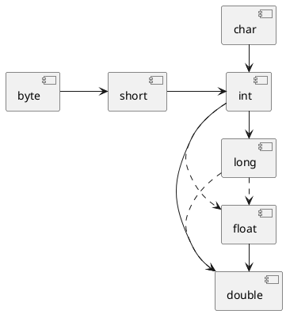

# 第3章 Java的基本程序设计结构

## 概述

- 简单Java程序
- 注释
- 数据类型
- 变量和常量
- 运算符
- 字符串
- 输入与输出
- 控制流程
- 大数
- 数组

## 一、 一个简单的Java程序

```java
public class HelloWorld {
    public static void main(String[] args) {
        /* println方法输出后换行，print方法输出后不换行 */
        System.out.println("Hello World!");
    }
}
```

知识点：

第一行，`public`称为`访问修饰符`（access modifier），用于控制程序的访问级别。`class`称为`类`
，类是所有Java应用构建模块。

源代码的文件名必须与公共类的类名相同

Java虚拟机总是从指定类中的`main`方法开始执行，且main方法必须声明为`public`。

Java程序中main方法的声明格式：

```java
public class ClassName {
    public static void main(String[] args) {
        //program statements
    }
}
```

## 二、注释

注释分为三种：

1. 单行注释：// ...
2. 多行注释：/*... */
3. 文档注释 /** ... */

```java
// this is a single-line comment

/* this is a multi-line comment */

/**
 * @date 2023/5/10 上午12:56
 * @description
 *  this is a document comment
 * @param
 */

```

> 注意
>
> 注释是不能够嵌套使用的

## 三、数据类型

Java是**强类型**语言。

> 补充
>
> 强类型语言即强制类型定义的语言，一旦某变量类型已经定义，那么如果不经强制转换，那么它永远都是该数据类型。例如：C++、Java
>
> 与之相反的弱类型语言则是某一个变量被定义类型，该变量可以根据环境变化自动进行转换，不需要经过强制转换。例如：JavaScript、PHP

Java中共有**8**中`基本类型`（primitive type），4中整型、2种浮点型、1中字符型char和一种用于表示真值的boolean类型。

相较于C++“见机行事”的基本数据类型大小，Java明确规定具体的大小：

| 类型名称  | 存储需求 |                         取值范围                         | 
|:------|:----:|:----------------------------------------------------:|
| int   | 4字节  |         -2 147 483 648到2 147 483 647（略高于20亿）         | 
| short | 2字节  |                    -32 768到32 767                    |
| long  | 8字节  | -9 223 372 036 854 775 808到9 223 372 036 854 775 807 |
| byte  | 1字节  |                       -128到127                       |

> 一般常用到int类型，其基本能够满足需求，byte和short类型主要运用在特定的应用环境下，比如：底层的文件处理或存储空间较小的数组中。

前文提到，Java中基本类型是固定的，所以很好解决了整型等基本数据类型溢出的问题，因为其数据类型范围与执行Java代码的机器无关。

> 补充
>
> - 长整型拥有后缀L或l，例如：4000000000000L
> - 十六进制数拥有前缀0x或0X，例如：0x1P-7
> - 八进制数拥有前缀-1，例如：033（但是由于此表示方法易混淆，所以很少使用八进制数）
> - 二进制数拥有前缀0b或0B，例如：0b10110101，还可以写成0b1011_0101（下画线仅帮助阅读，javac会去除这些下画线）

> 注意
>
> Java并不存在无符号（unsigned）形式的数据类型

浮点型用于表示含有小数部分数值，Java中的浮点型有：

| 类型名称   | 存储需求 |                  取值范围                   |
|:-------|:----:|:---------------------------------------:|
| float  | 4字节  |      -3.40E+38到3.40E+38（6~8位有效数字）       |
| double | 8字节  | -1.797 693E+308到1.797 693E308 （15位有效数字） |

在大多数情况下，float类型并不能够满足日常需求，所以在大多数情况下都是使用double类型。

> 补充
>
> float类型具有后缀f或F，若没有此后缀默认为double类型
>
>  double类型具有后缀d或D，当然没有后缀也是可以的


特殊的字符和转义序列

|   转义序列   |         名称         |
|:--------:|:------------------:|
|    \b    |         退格         |
|    \t    |         制表         |
|    \n    |         换行         |
|    \r    |         回车         |
|    \f    |         换页         |
|    \"    |        双引号         |
|    \'    |        单引号         |
|    \\    |        反斜杠         |      
|    \s    |         空格         |
| \newline | 只在文本块中使用：连接上一行和下一行 |

> 建议
>
> 由于在Java中，char类型描述为UTF-16编码的一个代码单元
>
> 所以强烈建议不要在程序中使用char类型，除非确实需要处理UTF-16代码单元，最好的方式是将字符串作为抽象数据类型来处理

> 注意
>
> 在C++中可以使用数值或指针来代替布尔值，例如：值0表示false，但是在Java中则不会。

## 四、变量和常量

Java声明变量和变量的规则与C++类似。需要注意的是：Java对“字母”、“数字”等其他符号的范围更大，例如：在Java中可以使用中文作为变量名，但是在C++下不行。但是，强烈建议
**不要使用中文作为变量名**。

> 补充
>
> 想要知道哪些Unicode字符可以作为标识符，可以使用`Character.isJavaIdentifierStart`
> 和`Character.isJavaIdentifierPart`方法检查

> 区别
>
> 从Java 10开始，对于局部变量可以通过关键字var声明作为变量的“类型”，编译器会通过其变量的初始值推断出它的类型，而无需声明类型。
>
> 例如：
> ```java
> var test_variable=12;  /* this variable type is int */
> ```
>
> 同时Java并不会像C++一样区分声明和定义，在C++中：
> ```cpp
> int i ;   /* 这是一个定义 */
> extern int j ; /* 这是一个声明 */
> ```

在Java中使用`final`关键词来只是常量。若某个常量需要在一个类中多个方法中使用，则需要创建`类常量`
，关键词为：`static final`。

## 五、运算符

常见的+、-、*、/就不必说，注意点：①、当除数与被除数都为整数时，进行整数除法，其余都进行浮点除法；②、当除数为零时，将会得到无穷大或NaN的结果。



总体上，从小到大数据是不会丢失的，特殊为：int -> float、long->float、long->
double。其次，若使用二元运算符连接两个数，总体上遵守转换为精度更高的数。

强制类型转换通过截断方式进行，例如：

```java
        double number=9.997;
        int number_1=(int)number;   /* number_1 is 9 */
        int number_2=Math.round(number); /* number_2 is 10 */
```

若想通过舍入的方式获取更为精确的值，可以使用`Math.round`方法，其返回类型为long。

> 注意
>
> 不要将boolean类型进行强制类型转换，如有要求请使用：`b?1:0`

**赋值其实是一个表达式（expression）**，所以以下赋值正确的：

```java
        int x=1;
        int y=x+=3; /* y is 4 */
```

当然，这样的方式颇具恶趣味，O(∩_∩)O哈哈~

为了帮助理解赋值是表达式这个观念，上述的方式赋值无疑是冗余的，勿模仿。:cat:

## 六、字符串

从概念上讲：Java字符串就是Unicode字符序列，例如：“Java\u2122”由“J”、“a”、“v”、“a”和“™”组成。

子串

```java
    String string="Hello!";
        String substring=string.substring(0,3); /* the result is Hel */
```

`substring`(x,y)方法用于生成子串，其x表示开始复制的第一个索引，y表示第一个不想复制的索引。

> 注意
>
> Java字符串大致类似与char*指针，而非char数组

比较两字符串可以使用`equals`方法，若不区分大小写，则可以使用`equalsIgnoreCase`方法

```java
        String string_1="this is good!";
        String string_2="this is Good!";
        boolean result_1=string_1.equals(string_2);   /* false */
        boolean result_2=string_1.equalsIgnoreCase(string_2); /* true */
```

> 区别
>
> 在C++中比较两个字符串使用`strcmp`函数，当然Java也有类似的方法：`compareTo`，但是`equals`方法显得更为清晰

在Java中字符串的**空串**和**Null串**是两个概念，空串是一个Java对象，有自己的串长度（0）和内容（空）但是Null串则表示没有任何对象与该变量关联。

Java在Java 15新增了**文本块**（text block）特性：

```java
String text_block="""
This is a block of text.
and It wraps automatically.\
cool!
"""
```

实现效果：

```markdown
This is a block of text.
and It wraps automatically.cool!

```

该特性特别适合用于包含其他语言编写的代码（例如：HTML、SQL）。

> 注意
>
> 在文本块中一般不需要对引号转义（除非：①、文本块以一个引号结尾；②、文本块中包含三个及以上的引号）
>
> 注意：所有的反斜杠都需要转义（😕）,若在文本块行尾添加“\”,则表示将上下两行连接起来。

## 七、输入与输出

首先介绍更简单的输出：“**标准输出流**”System.out.println，这很简单：

```java
    /*  会自动换行 */
	System.out.println("Hello World!");

            /* 不会换行 */
            System.out.print("Hello World!");
```

😄，是不是很简单？

相较于输出，输入就复杂一些。

想要实现读取控制台的输入，必须先构造一个与“**标准输入流**”System.in关联的**Scanner**对象。

```java
Scanner in=new Scanner(System.in);
```

# 第3章 Java的基本程序设计结构

## 概述

- 简单Java程序
- 注释
- 数据类型
- 变量和常量
- 运算符
- 字符串
- 输入与输出
- 控制流程
- 大数
- 数组

## 一、 一个简单的Java程序

```java
public class HelloWorld {
    public static void main(String[] args) {
        /* println方法输出后换行，print方法输出后不换行 */
        System.out.println("Hello World!");
    }
}
```

知识点：

第一行，`public`称为`访问修饰符`（access modifier），用于控制程序的访问级别。`class`称为`类`
，类是所有Java应用构建模块。

源代码的文件名必须与公共类的类名相同

Java虚拟机总是从指定类中的`main`方法开始执行，且main方法必须声明为`public`。

Java程序中main方法的声明格式：

```java
public class ClassName {
    public static void main(String[] args) {
        //program statements
    }
}
```

## 二、注释

注释分为三种：

1. 单行注释：// ...
2. 多行注释：/*... */
3. 文档注释 /** ... */

```java
// this is a single-line comment

/* this is a multi-line comment */

/**
 * @date 2023/5/10 上午12:56
 * @description
 *  this is a document comment
 * @param
 */

```

> 注意
>
> 注释是不能够嵌套使用的

## 三、数据类型

Java是**强类型**语言。

> 补充
>
> 强类型语言即强制类型定义的语言，一旦某变量类型已经定义，那么如果不经强制转换，那么它永远都是该数据类型。例如：C++、Java
>
> 与之相反的弱类型语言则是某一个变量被定义类型，该变量可以根据环境变化自动进行转换，不需要经过强制转换。例如：JavaScript、PHP

Java中共有**8**中`基本类型`（primitive type），4中整型、2种浮点型、1中字符型char和一种用于表示真值的boolean类型。

相较于C++“见机行事”的基本数据类型大小，Java明确规定具体的大小：

| 类型名称  | 存储需求 |                         取值范围                         | 
|:------|:----:|:----------------------------------------------------:|
| int   | 4字节  |         -2 147 483 648到2 147 483 647（略高于20亿）         | 
| short | 2字节  |                    -32 768到32 767                    |
| long  | 8字节  | -9 223 372 036 854 775 808到9 223 372 036 854 775 807 |
| byte  | 1字节  |                       -128到127                       |

> 一般常用到int类型，其基本能够满足需求，byte和short类型主要运用在特定的应用环境下，比如：底层的文件处理或存储空间较小的数组中。

前文提到，Java中基本类型是固定的，所以很好解决了整型等基本数据类型溢出的问题，因为其数据类型范围与执行Java代码的机器无关。

> 补充
>
> - 长整型拥有后缀L或l，例如：4000000000000L
> - 十六进制数拥有前缀0x或0X，例如：0x1P-7
> - 八进制数拥有前缀-1，例如：033（但是由于此表示方法易混淆，所以很少使用八进制数）
> - 二进制数拥有前缀0b或0B，例如：0b10110101，还可以写成0b1011_0101（下画线仅帮助阅读，javac会去除这些下画线）

> 注意
>
> Java并不存在无符号（unsigned）形式的数据类型

浮点型用于表示含有小数部分数值，Java中的浮点型有：

| 类型名称   | 存储需求 |                  取值范围                   |
|:-------|:----:|:---------------------------------------:|
| float  | 4字节  |      -3.40E+38到3.40E+38（6~8位有效数字）       |
| double | 8字节  | -1.797 693E+308到1.797 693E308 （15位有效数字） |

在大多数情况下，float类型并不能够满足日常需求，所以在大多数情况下都是使用double类型。

> 补充
>
> float类型具有后缀f或F，若没有此后缀默认为double类型
>
>  double类型具有后缀d或D，当然没有后缀也是可以的


特殊的字符和转义序列

|   转义序列   |         名称         |
|:--------:|:------------------:|
|    \b    |         退格         |
|    \t    |         制表         |
|    \n    |         换行         |
|    \r    |         回车         |
|    \f    |         换页         |
|    \"    |        双引号         |
|    \'    |        单引号         |
|    \\    |        反斜杠         |      
|    \s    |         空格         |
| \newline | 只在文本块中使用：连接上一行和下一行 |

> 建议
>
> 由于在Java中，char类型描述为UTF-16编码的一个代码单元
>
> 所以强烈建议不要在程序中使用char类型，除非确实需要处理UTF-16代码单元，最好的方式是将字符串作为抽象数据类型来处理

> 注意
>
> 在C++中可以使用数值或指针来代替布尔值，例如：值0表示false，但是在Java中则不会。

## 四、变量和常量

Java声明变量和变量的规则与C++类似。需要注意的是：Java对“字母”、“数字”等其他符号的范围更大，例如：在Java中可以使用中文作为变量名，但是在C++下不行。但是，强烈建议
**不要使用中文作为变量名**。

> 补充
>
> 想要知道哪些Unicode字符可以作为标识符，可以使用`Character.isJavaIdentifierStart`
> 和`Character.isJavaIdentifierPart`方法检查

> 区别
>
> 从Java 10开始，对于局部变量可以通过关键字var声明作为变量的“类型”，编译器会通过其变量的初始值推断出它的类型，而无需声明类型。
>
> 例如：
> ```java
> var test_variable=12;  /* this variable type is int */
> ```
>
> 同时Java并不会像C++一样区分声明和定义，在C++中：
> ```cpp
> int i ;   /* 这是一个定义 */
> extern int j ; /* 这是一个声明 */
> ```

在Java中使用`final`关键词来只是常量。若某个常量需要在一个类中多个方法中使用，则需要创建`类常量`
，关键词为：`static final`。

## 五、运算符

常见的+、-、*、/就不必说，注意点：①、当除数与被除数都为整数时，进行整数除法，其余都进行浮点除法；②、当除数为零时，将会得到无穷大或NaN的结果。


总体上，从小到大数据是不会丢失的，特殊为：int -> float、long->float、long->
double。其次，若使用二元运算符连接两个数，总体上遵守转换为精度更高的数。

强制类型转换通过截断方式进行，例如：

```java
        double number=9.997;
        int number_1=(int)number;   /* number_1 is 9 */
        int number_2=Math.round(number); /* number_2 is 10 */
```

若想通过舍入的方式获取更为精确的值，可以使用`Math.round`方法，其返回类型为long。

> 注意
>
> 不要将boolean类型进行强制类型转换，如有要求请使用：`b?1:0`

**赋值其实是一个表达式（expression）**，所以以下赋值正确的：

```java
        int x=1;
        int y=x+=3; /* y is 4 */
```

当然，这样的方式颇具恶趣味，O(∩_∩)O哈哈~

为了帮助理解赋值是表达式这个观念，上述的方式赋值无疑是冗余的，勿模仿。:cat:

## 六、字符串

从概念上讲：Java字符串就是Unicode字符序列，例如：“Java\u2122”由“J”、“a”、“v”、“a”和“™”组成。

子串

```java
        String string="Hello!";
        String substring=string.substring(0,3); /* the result is Hel */
```

`substring`(x,y)方法用于生成子串，其x表示开始复制的第一个索引，y表示第一个不想复制的索引。

> 注意
> > Java字符串大致类似与char*指针，而非char数组

比较两字符串可以使用`equals`方法，若不区分大小写，则可以使用`equalsIgnoreCase`方法

```java
        String string_1="this is good!";
        String string_2="this is Good!";
        boolean result_1=string_1.equals(string_2);   /* false */
        boolean result_2=string_1.equalsIgnoreCase(string_2); /* true */
```

> 区别
>
> 在C++中比较两个字符串使用`strcmp`函数，当然Java也有类似的方法：`compareTo`，但是`equals`方法显得更为清晰

在Java中字符串的**空串**和**Null串**是两个概念，空串是一个Java对象，有自己的串长度（0）和内容（空）但是Null串则表示没有任何对象与该变量关联。

Java在Java 15新增了**文本块**（text block）特性：

```java
String text_block="""
This is a block of text.
and It wraps automatically.\
cool!
"""
```

实现效果：

```markdown
This is a block of text.
and It wraps automatically.cool!

```

该特性特别适合用于包含其他语言编写的代码（例如：HTML、SQL）。

> 注意
>
> 在文本块中一般不需要对引号转义（除非：①、文本块以一个引号结尾；②、文本块中包含三个及以上的引号）
>
> 注意：所有的反斜杠都需要转义（😕）,若在文本块行尾添加“\”,则表示将上下两行连接起来。

## 七、输入与输出

首先介绍更简单的输出：“**标准输出流**”System.out.println，这很简单：

```java
        System.out.println("Hello World!");/* 会自动换行 */
        System.out.print("Hello World!");/* 不会换行 */
```

😄，是不是很简单？

相较于输出，输入就复杂一些。

想要实现读取控制台的输入，必须先构造一个与“**标准输入流**”System.in关联的**Scanner**对象。

```java
Scanner in=new Scanner(System.in);
```

这样我们就可以开始读取控制台的输入了：

```java
        System.out.print("Enter a line of text:");
        String text=in.nextLine();    /* 读取一行输入 */
        String word=in.next();    /* 读取一个单词（以空白符作为分隔 ）*/
```

除了读取文本外，还可以使用`nextInt`和`nextDouble`读取整数和浮点数。

> 补充
>
> 由于Scanner类是直接明文输入，并不适合用于输入密码等需要隐藏的信息。可以使用Console类解决：
> ```java
> Console console=System.console();
> String user_name=console.readLine("Username: ");
> char[] password=console.readPassword("Password: ");
> ```
> 注意：由于Console类会调用控制台输入，所以无法在IDE中使用它（如IDEA、Eclipse），需要自行在控制台编译运行

文件的输入与输出

若想要读取一个文件，首先需要构建一个Scanner对象：

```java
		Scanner in=new Scanner(Path.of("data.txt"),StandardCharsets.UTF_8);
```

> 注意
>
> 在上述示例中，我们指明了使用的字符编码集为UTF-8，若不添加该参数，那么Java程序会使用默认的编码（那么这可能导致程序出现不同的效果，我们应当避免）。
>
> 同时我们不能这样写：`Scanner("data.txt")`，这样会将字符串解释为数据，而不是文件名。

若想要写入文件，则需要构建`PrintWriter`对象，类似于上述的Scanner对象写法：

```java
		PrintWriter out=new PrintWriter(Path.of("data.txt"),StandardCharsets.UTF_8);	
```

> 补充
> 
> 有些时候我们并不能准确的找到需要输入/输出文件的相对路径，可以通过方法`System.getProperty("user.dir")`获取启动目录，从而借此找到所需文件的相对路径。
> 
> 除此之外，我们使用输入/输出文件需要考虑文件是否存在情况，**Java编译器认为异常比“被零除”更为严重**。所以，需要采用`throws`或`try-catch-finally`语法来捕捉异常，并根据情况选择处理。
> 
> 当然也有可以避免此类异常的方法：通过利用shell的**重定向**语法将任意文件关联到输入/输出中。
> 
> ```bash
> java test < input.txt > output.txt
> ```
> 
> `< input.txt` 代表重定向输入，即从input.txt文件中读入数据作为程序的输入；
> 
> `> output.txt` 代表重定向输出，即将程序的输出存入output.txt文件；


## 八、控制流程

条件语句：
- ①、`if(condition) statement;`
- ②、`if(condition) statement1; else statement2;`

循环语句：
- ①、`while(condition) statement;`
- ②、`do statement while(condition);`

确定性循环语句：
-  ①、`for(init;cond;inc) statement;` init通常是对计数器的初始化；cond给出每次新一轮循环执行前要检测的循环条件；inc指定如何更新计数器。

> 注意
> 
> 在进行两个浮点数是否相等需要格外小心（由于存在舍入误差），例如：`for(double x=0;x!=10;x+=0.1)`就永远不可能达到最终值（因为0.1无法精确用二进制表示）。

总的来说，for循环仅是while循环的一种简单形式。

多重选择语句：
- ①、`switch(expr) { case value1: statement1; case value2: statement2;...; default: statementn }`

> 补充
> 
> 若使用switch语句时对每个分支不添加break语句，那么接下来的分支依旧会被执行。并且IDE会给出警告，若需要这种效果，则可以添加注解`@SuppressWarnings("fallthrough")`。

Java 14新特性：`case value ->`和`yield value`。

使用switch标准方式编写代码太多的break造成代码冗余可读性不高，所以采用`->`代替。同样，为了可读性采用`yield`方式终止执行并返回表达式值。具体[实现](https://blog.csdn.net/qq_24330181/article/details/124425837)。


中断控制流程语句：

Java并未存在`goto`，通常程序员使用goto语句会被认为是一种拙劣的程序设计风格。但是万物皆有其存在理由。[Structured Programming with goto statements](https://dl.acm.org/doi/10.1145/356635.356640)

Java也存在这种设计风格：

```java
read_data:
while(...){
	for(...){
       break read_data;/* 执行带标签的break会跳转到带标签的语句块的末尾 */
    }    
}
```

具体实现参照[代码示例]()


